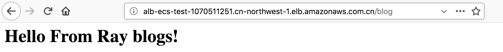

# Amazon API Gateway with microservices deployed on Amazon ECS

How to use Amazon API Gateway to expose APIs for microservices running on Amazon ECS by leveraging the HTTP proxy mode of Amazon API Gateway. Amazon API Gateway can make proxy calls to any publicly accessible endpoint; for example, an Elastic Load Balancing load balancer endpoint in front of a microservice that is deployed on Amazon ECS.

https://aws.amazon.com/cn/blogs/compute/using-amazon-api-gateway-with-microservices-deployed-on-amazon-ecs/


## Using NLB and ALB integrated with ECS services
[NLB with ECS](https://aws.amazon.com/about-aws/whats-new/2017/09/amazon-ec2-container-service-now-integrated-with-network-load-balancer-to-support-high-throughput-and-direct-tcp-connections-with-containers/)

[Using ALB and NLB with ECS](https://medium.com/containers-on-aws/using-aws-application-load-balancer-and-network-load-balancer-with-ec2-container-service-d0cb0b1d5ae5)

[Terraform ECS Fargate NLB](https://github.com/turnerlabs/terraform-ecs-fargate-nlb)

## If you need make API GW integrated with ALB/NLB via Private link
https://docs.aws.amazon.com/apigateway/latest/developerguide/set-up-private-integration.html

1. Set up a Network Load Balancer for API Gateway Private Integrations
2. Grant Permissions to Create a VPC Link
3. Set up an API Gateway API with Private Integrations Using the API Gateway Console / AWS CLI

## How to choice NLB v.s ALB
- If need L7 routing

API GW - ALB - ECS (both for dynamic or static port)

- If need L4 routing

API GW - NLB - ECS (both for dynamic or static port)

- If need L4 routing and private link

API GW - NLB - ECS (both for dynamic or static port)

- If need L7 routing and private link

API GW - NLB - ALB - ECS (both for dynamic or static port)

## Demo
### Create Docker images
1. blog.py

```python
from flask import Flask
from flask import render_template

app = Flask(__name__)

@app.route('/blog')
def blog():
    return render_template('blog.html',title='blog')


if __name__ == '__main__':
    app.run(threaded=True,host='0.0.0.0',port=8080)
```

2. Dockfile for blog

```
FROM centos:centos7

LABEL maintainer="ruiliang@amazon.com"

RUN yum -y update; yum clean all
RUN yum -y install epel-release; yum clean all
RUN yum -y install python-pip; yum clean all
RUN pip install --upgrade pip;
RUN pip install flask;
RUN pip install boto3;

COPY . /src

EXPOSE 8080

CMD cd /src && python blog.py
```

3. webpage.py

```python
from flask import Flask
from flask import render_template
import boto3
import json

app = Flask(__name__)

@app.route('/')
def webpage():
    return render_template('webpage.html',title='webpage')

if __name__ == '__main__':
    app.run(threaded=True,host='0.0.0.0',port=5000)
```

4. Dockfile for webpage

```
FROM centos:centos7

LABEL maintainer="ruiliang@amazon.com"

RUN yum -y update; yum clean all
RUN yum -y install epel-release; yum clean all
RUN yum -y install python-pip; yum clean all
RUN pip install --upgrade pip;
RUN pip install flask;
RUN pip install boto3;

COPY . /src

EXPOSE 5000

CMD cd /src && python webpage.py
```

### Build image and push to ECR

```bash
docker build -t ray-alb-demo-blog .
docker build -t ray-alb-demo-web .

aws ecr create-repository --repository-name ray-alb-demo-blog --region cn-northwest-1 --profile china
aws ecr create-repository --repository-name ray-alb-demo-web --region cn-northwest-1 --profile china

<Accoun_id>.dkr.ecr.cn-northwest-1.amazonaws.com.cn/ray-alb-demo-blog
<Accoun_id>.dkr.ecr.cn-northwest-1.amazonaws.com.cn/ray-alb-demo-web

aws ecr get-login --region cn-northwest-1 --profile china

docker tag ray-alb-demo-blog <Accoun_id>.dkr.ecr.cn-northwest-1.amazonaws.com.cn/ray-alb-demo-blog
docker tag ray-alb-demo-web <Accoun_id>.dkr.ecr.cn-northwest-1.amazonaws.com.cn/ray-alb-demo-web

docker push <Accoun_id>.dkr.ecr.cn-northwest-1.amazonaws.com.cn/ray-alb-demo-blog
docker push <Accoun_id>.dkr.ecr.cn-northwest-1.amazonaws.com.cn/ray-alb-demo-web

```

### Create the ECS task definitions

### Create ALB and target group
- Blog-ECS-tg: forward to 8080
- Webpage-ECS-tg: forward to 5000

[alb-dynamic-mapping-tg](media/alb-dynamic-mapping-tg.png)

### Access ALB testing
- Access the webpage


- Access the blog



## Exposed with API GW
The ECS cluster can be private while ALB is internet-facing

1. API GW using HTTP Proxy as integration
2. For Endpoint URL, type ALB URL to access the 2 microserivces


3. Testing
```bash
curl https://<API_GW_DNS>/<Stage>/blog
<html><h1>Hello From Ray blogs!</h1></html>
curl https://<API_GW_DNS>/<Stage>/webpage
<html><h1>Hello World From Ray Webpage!</h1></html>
```