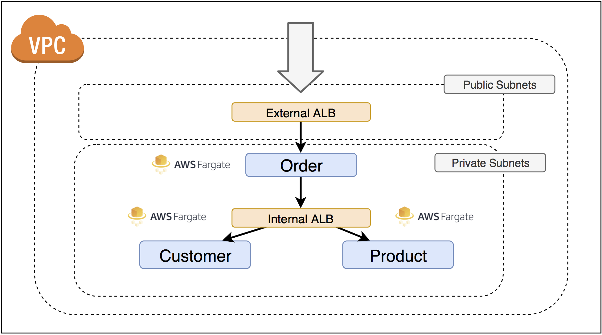

# ECS Fargate Quick Start

AWS Fargate is a technology for Amazon ECS that allows you to run containers without having to manage servers or clusters. With AWS Fargate, you no longer have to provision, configure, and scale clusters of virtual machines to run containers. 

Fargate lets you focus on designing and building your applications instead of managing the infrastructure that runs them such as scale your clusters, or optimize cluster packing.

## Running Services in AWS Fargate

The quick start architecture: A 3-tier e-commerce microservices on AWS Fargate. It based on https://github.com/pahud/aws-containers-workshop/. 

The architecture containers 3 micro services:
- Order - public-facing API for ticket ordering
- Product - product system
- Customer - customer system



**You can create and manage the Fargate via AWS ECS console, here we introduce the Fargate CLI for better automation**

## Install Fargate CLI

Fargate CLI right now do not support China region, please refer below issue: https://github.com/awslabs/fargatecli/issues/110

The workshop commands are executed on Cloud9 IDE launched from AWS China Marketplace

[Cloud9 IDE in China region guide](https://github.com/linjungz/cloud9)

Install fargate CLI from github on your Cloud9 IDE.

```bash
curl https://github.com/awslabs/fargatecli/releases/download/0.3.2/fargate-0.3.2-linux-amd64.zip -Lo fargate.zip
unzip fargate.zip
sudo mv fargate /usr/local/bin/
fargate --version
$ fargate version 0.3.0
```

## Create the Front-end order service
```bash
export AWS_REGION=ap-northeast-1
# create external-lb for order service in public subnets
fargate lb create order-lb --port 80 \
--subnet-id subnet-pub-1,subnet-pub-2,subnet-pub-3 \
--security-group-id sg-public-lb
[i] Created load balancer order-lb
# list the lb
fargate lb list | grep order-lb
order-lb        Application     Active  order-lb-500766783.ap-northeast-1.elb.amazonaws.com     HTTP:80
# create the order service in the private subnets
fargate service create order --lb order-lb --image pahud/aws-container-workshop-service:latest \
--env SERVICENAME=order --env VERSIONNUM=1.0 --port http:8080 \
--subnet-id subnet-private-1,subnet-private-2,subnet-private-3 \
--security-group-id sg-service-order
[i] Created service order
# list the services
fargate service list | grep order
NAME    IMAGE                                           CPU     MEMORY  LOAD BALANCER   DESIRED RUNNING PENDING
order   pahud/aws-container-workshop-service:latest     256     512     order-lb        1       1       0
# check the order service info
fargate service info order
[2020-05-11 05:04:59 +0000 UTC] (service order) has reached a steady state.

order-alb=$(fargate service info order | grep "DNS Name" | cut -d ":" -f2 | tr -d [:space:])
# curl on the www ALB
curl ${order-alb}
{"service":"order","version":"1.0"}
```

## Create the backend-end cms and ticket service
### create a private LB
```bash
# create a private LB
fargate lb create priv-lb --port http:80 --scheme internal \
--subnet-id subnet-private-1,subnet-private-2,subnet-private-3 \
--security-group-id sg-private-lb
[i] Created load balancer priv-lb
```

### deploy CMS service
```bash
fargate service create cms --lb priv-lb -r host=cms.demo.local \
--image pahud/aws-container-workshop-service:latest \
--env SERVICENAME=cms --env VERSIONNUM=1.0 --port http:8080 \
--subnet-id subnet-private-1,subnet-private-2,subnet-private-3 \
--security-group-id sg-service-cms
[i] Created service cms

fargate service info cms
```

### create the ticket service
```bash
fargate service create ticket --lb priv-lb -r host=ticket.demo.local \
--image pahud/aws-container-workshop-service:latest \
--env SERVICENAME=ticket --env VERSIONNUM=1.0 --port http:8080 \
--subnet-id subnet-private-1,subnet-private-2,subnet-private-3 \
--security-group-id sg-service-ticket
[i] Created service ticket

fargate service info ticket
```

## Service registrer and discovery
### Create demo.local private hosted zone on Route53
```bash
# craete a private hosted zone "demo.local"
aws route53 create-hosted-zone --name demo.local \
--vpc VPCRegion=ap-northeast-1,VPCId=<VPC_ID> --caller-reference ="$(date)" --hosted-zone-config PrivateZone=true

# Optional - associate to more VPCs in the same region
aws route53 associate-vpc-with-hosted-zone --hosted-zone-id YOUR_ZONE_ID  \
--vpc VPCRegion=ap-northeast-1,VPCId=<VPC_ID_2>
```

### create 2 aliases for cms.demo.local and ticket.demo.local to the dns name of priv-lb.
```bash
aws route53 change-resource-record-sets --hosted-zone-id YOUR_ZONE_ID  --change-batch file://cms-alias.json

{
     "Comment": "Creating Alias resource record sets in Route 53",
     "Changes": [{
                "Action": "CREATE",
                "ResourceRecordSet": {
                            "Name": "cms.demo.local",
                            "Type": "A",
                            "AliasTarget":{
                                    "HostedZoneId": "Z14GRHDCWA56QT",
                                    "DNSName": "internal-priv-lb-1149407287.ap-northeast-1.elb.amazonaws.com",
                                    "EvaluateTargetHealth": false
                              }}
                }]
}

aws route53 change-resource-record-sets --hosted-zone-id YOUR_ZONE_ID --change-batch file://ticket-alias.json
{
     "Comment": "Creating Alias resource record sets in Route 53",
     "Changes": [{
                "Action": "CREATE",
                "ResourceRecordSet": {
                            "Name": "ticket.demo.local",
                            "Type": "A",
                            "AliasTarget":{
                                    "HostedZoneId": "Z14GRHDCWA56QT",
                                    "DNSName": "internal-priv-lb-1149407287.ap-northeast-1.elb.amazonaws.com",
                                    "EvaluateTargetHealth": false
                              }}
                }]
}

# Check the resource-record-sets
aws route53 list-resource-record-sets --hosted-zone-id YOUR_ZONE_ID

# On the Cloud9 or EC2 in the same VPC of ECS Fargate cluster
nslookup cms.demo.local
nslookup ticket.demo.local
```

### update the order service to invoke the backend cms and ticket service

Lookup the serivce via environment variables: 
- PRODUCT_SVC_URL=http://ticket.demo.local
- CUSTOMER_SVC_URL=http://cms.demo.local

```bash
# destroy the order service
fargate service scale order 0
fargate service destroy order

# create order with backend service info
fargate service create order --lb order-lb --image pahud/aws-container-workshop-service:order-latest \
--port http:8080 --subnet-id subnet-private-1,subnet-private-2,subnet-private-3 \
--security-group-id sg-service-order \
--env SERVICENAME=order --env VERSIONNUM=1.0 \
-e PRODUCT_SVC_URL=http://ticket.demo.local -e CUSTOMER_SVC_URL=http://cms.demo.local

[i] Created service order

order-alb = $(fargate service info order | grep "DNS Name" | cut -d ":" -f2 | tr -d [:space:])
echo ${order-alb}
curl ${order-alb}
{"service":"order", "version":"1.0"}
{"service":"cms","version":"1.0"}
{"service":"ticket","version":"1.0"}
```

## Clean up
```bash
# destroy the order service
fargate service scale order 0 && fargate service destroy order
# destroy the cms service
fargate service scale cms 0 && fargate service destroy cms
# destroy the ticket service
fargate service scale ticket 0 && fargate service destroy ticket

# destroy the order-lb load balancer
fargate lb destroy order-lb
# destroy the priv-lb load balancer
fargate lb destroy priv-lb

# DNS zone sets in demo.local and delete the private hosted zone from Route53
aws route53 disassociate-vpc-from-hosted-zone --hosted-zone-id YOUR_ZONE_ID --vpc VPCRegion=ap-northeast-1,VPCId=<VPC_ID>
aws route53 change-resource-record-sets --hosted-zone-id YOUR_ZONE_ID  --change-batch file://cms-alias.json
aws route53 change-resource-record-sets --hosted-zone-id YOUR_ZONE_ID  --change-batch file://ticket-alias.json
aws route53 delete-hosted-zone --id YOUR_ZONE_ID 
```