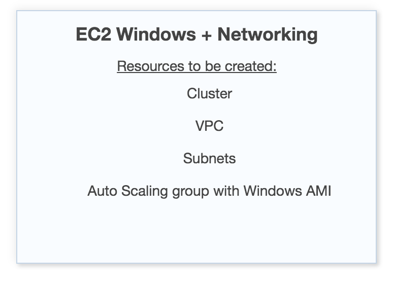
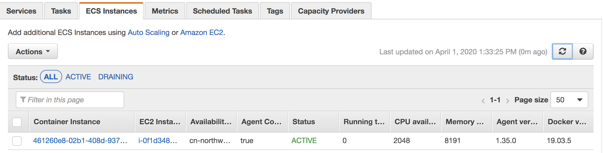
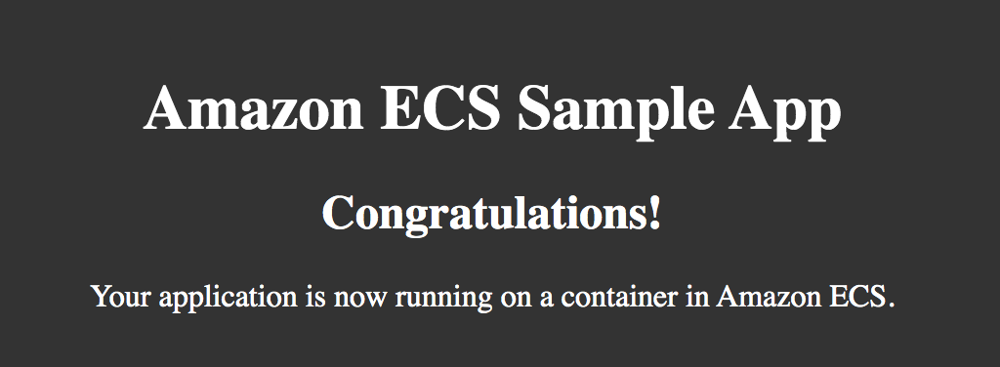

# Running Windows Containers on Amazon ECS

## Overview
Amazon ECS supports Windows containers on instances that are launched with the Amazon ECS-optimized Windows AMI.

On the Amazon ECS-optimized Windows AMI, the Amazon ECS container agent runs as a service on the host. Unlike the Linux platform, the agent does not run inside a container because it uses the host's registry and the named pipe at ```\\.\pipe\docker_engine``` to communicate with the Docker daemon. 

The source code for the Amazon ECS container agent is available on [GitHub](https://github.com/aws/amazon-ecs-agent). You can view open issues for Amazon ECS and Windows on GitHub issues page. 


**Amazon ECS-optimized AMIs**
- Amazon ECS-optimized Windows 2019 Full AMI – Recommended for launching your Amazon ECS container instances on the Windows operating system.
- Amazon ECS-optimized Windows 2019 Core AMI – Recommended for launching your Amazon ECS container instances on the Windows operating system.

## Important information
1. Windows containers cannot run on Linux container EC2 instances and vice versa. You can ensure that Windows task definitions are only placed on Windows instances by setting the following placement constraint: ```memberOf(ecs.os-type=='windows')```.
2. Windows containers now are only supported for tasks that use the EC2 launch type.
3. [Windows task definition parameters](https://docs.aws.amazon.com/AmazonECS/latest/developerguide/windows_task_definitions.html)
4. Set correct [IAM Role for Windows Tasks](https://docs.aws.amazon.com/AmazonECS/latest/developerguide/windows_task_IAM_roles.html)
5. The IAM roles for tasks feature uses a credential proxy to provide credentials to the containers. This credential proxy runs on port 80, so if you use IAM roles for tasks, you need use an Application Load Balancer and dynamic port mapping to provide standard HTTP port 80 connections to your containers. [Details page](https://docs.aws.amazon.com/AmazonECS/latest/developerguide/service-load-balancing.html)
6. The Windows server Docker images are large (9 GiB), so your container EC2 instances require more storage space.


## Quick start
[Quick Start guide](https://docs.aws.amazon.com/AmazonECS/latest/developerguide/ECS_Windows_getting_started.html)

### Step 1 Create Cluster
0. Checkt the ecsInstanceRole
```bash
aws iam list-instance-profiles-for-role --role-name ecsInstanceRole --region cn-northwest-1
```

- Option1: By ECS console wizard



- Option2: Step by Step

1. Create empty Windows Cluster
```bash
aws ecs create-cluster --cluster-name windows-demo --region cn-northwest-1
```

2. Launching a Windows Container EC2 Instance on EC2 console

    1. Search the 'ECS_Optimized'
    2. Select from 'Community AMIs' and for example:
    Windows_Server-2019-English-Full-ECS_Optimized-2020.01.16
    3. Instance type: 'm4.large'
    4. Auto-assign Public IP
    5. Select the 'ecsInstanceRole' IAM role
    6. 'User data' input below script to registers EC2 container instance into the 'windows-demo' cluster 
    <powershell>
    Import-Module ECSTools
    Initialize-ECSAgent -Cluster 'windows-demo' -EnableTaskIAMRole
    </powershell>
    7. Add Storage: 200 GiB
    8. Add Tag: 'Name:ecs-windows-demo'
    8. Secuirty group make sure '3389', '8080' ports opened


It can take up to 15 minutes for your Windows container instance to register with your cluster. 

Once it complete, you can check the instances shown under 'ECS Instances' tab of 'windows-demo' cluster 



### Step 2 Register a Windows Task Definition

1. Sample Json task definition
windows-simple-iis.json
```json
{
  "family": "windows-simple-iis",
  "containerDefinitions": [
    {
      "name": "windows_sample_app",
      "image": "microsoft/iis",
      "cpu": 512,
      "entryPoint":["powershell", "-Command"],
      "command":["New-Item -Path C:\\inetpub\\wwwroot\\index.html -ItemType file -Value '<html> <head> <title>Amazon ECS Sample App</title> <style>body {margin-top: 40px; background-color: #333;} </style> </head><body> <div style=color:white;text-align:center> <h1>Amazon ECS Sample App</h1> <h2>Congratulations!</h2> <p>Your application is now running on a container in Amazon ECS.</p>' -Force ; C:\\ServiceMonitor.exe w3svc"],
      "portMappings": [
        {
          "protocol": "tcp",
          "containerPort": 80,
          "hostPort": 8080
        }
      ],
      "memory": 768,
      "essential": true
    }
  ]
}
```

2. Create new Task Definition
  - On ECS console
  1. Choose Task Definitions
  2. Select launch type as EC2
  3. Configure via JSON
  4. Save

  - CLI
  ```bash
  aws ecs register-task-definition --cli-input-json file://script/windows-simple-iis.json  --region cn-northwest-1
  ```
  [CLI register-task-definition guide](https://docs.aws.amazon.com/cli/latest/reference/ecs/register-task-definition.html)

### Step 3 Run containers with ECS:
There are 2 options to run container on ECS
- Task - a short-lived process
- Service - longer-running containers and can be configured to use a load balancer

### Opition 1 Create the Task
- Console
    1. Select the task definition 'windows-simple-iis' and choose Action, Run Task.
    2. Leave the default settings.
    3. Select the ECS cluster 'windows-demo'.
    4. Choose Run Task to start the process of scheduling a Docker container on your ECS cluster.
- CLI
    ```bash
    aws ecs run-task --cluster windows-demo --task-definition windows-simple-iis:1 --region cn-northwest-1
    ```
### Option 2 Create Service
- Console
    1. Select the task definition 'windows-simple-iis' and choose Create Service.
    2. Service name: windows-simple-iis
    3. Service type: REPLICA
    4. Number of tasks: 1 
    5. Deployment type: Rolling update 
    
    You can also Associate a load balancer and Set up Auto Scaling.

- CLI
```bash
aws ecs create-service --cluster windows-demo --task-definition windows-simple-iis:1 --desired-count 1 --service-name windows-simple-iis-svc --region cn-northwest-1
```

## Step 4 View Your Service:
1. In the Network bindings of the Task, you should see an External Link IP address and port combination link.
2. Open the IIS test page in your browser. 



## Step 5 Scaling Container Instances with CloudWatch Alarms (optional)
[Scaling Container Instances with CloudWatch Alarms](https://docs.aws.amazon.com/AmazonECS/latest/developerguide/cloudwatch_alarm_autoscaling.html)

## Step 6 cleanup
```
aws ecs delete-service --cluster windows-demo --service windows-simple-iis-svc --region cn-northwest-1
aws ecs list-container-instances --cluster windows-demo --region cn-northwest-1
aws ecs deregister-container-instance --cluster windows-demo \
    --container-instance <containerInstanceArn> \
    --force --region cn-northwest-1
aws ecs delete-cluster --cluster windows-demo --region cn-northwest-1
aws ec2 terminate-instances --instance-ids <ec2-instance-id> --region cn-northwest-1
```
## Production reference architecture
[Deploying Microservices with Amazon ECS, AWS CloudFormation, and an Application Load Balancer](https://github.com/aws-samples/ecs-refarch-cloudformation-windows)

