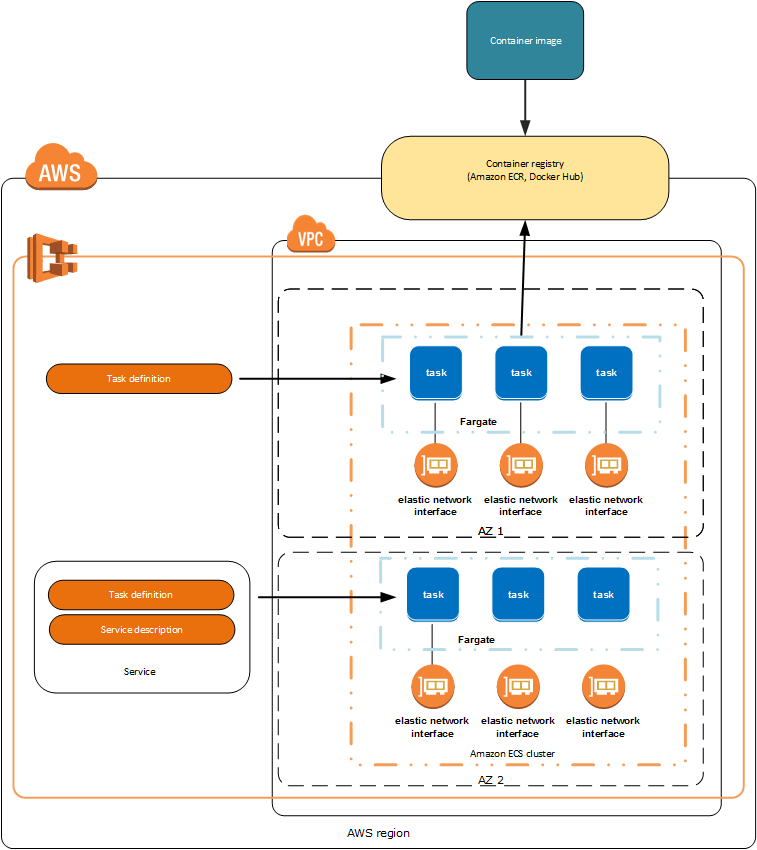

# ECS Workshop for China region

## AWS Fargate Overview

AWS Fargate is a technology for Amazon ECS that allows you to run containers without having to manage servers or clusters. With AWS Fargate, you no longer have to provision, configure, and scale clusters of virtual machines to run containers.

Fargate lets you focus on designing and building your applications instead of managing the infrastructure that runs them such as scale your clusters, or optimize cluster packing.

### [ECS Fargate Workshop - Module01 - Prepare](Fargate01-Prepare.md)

### [ECS Fargate Workshop - Module02 - Deploy Micro Services](Fargate02-Deploy-MicroServices.md)

### [Service Discovery](Service-Discvoery.md)
