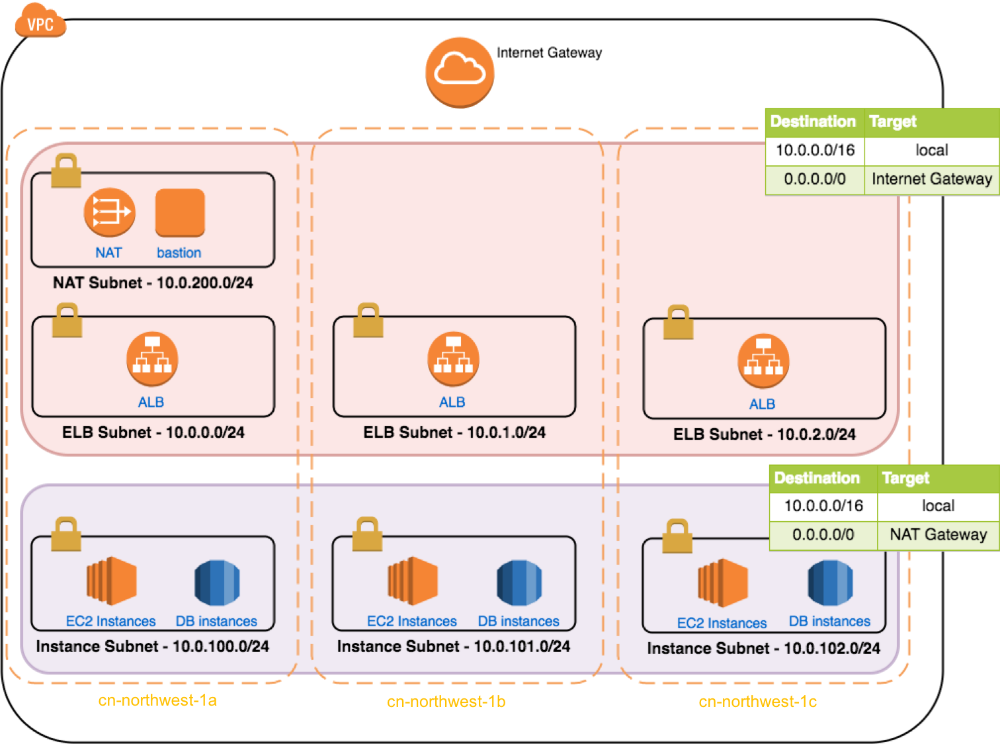

# ECS Fargate Workshop - Module01 - Prepare

## Install and Configure Tools

The workshop is running on Cloud9 IDE launched from AWS China Marketplace

[Cloud9 IDE in China region guide](https://github.com/linjungz/cloud9)

### ecscli

```bash
sudo curl -so /usr/local/bin/ecs-cli https://s3.amazonaws.com/amazon-ecs-cli/ecs-cli-linux-amd64-latest
sudo chmod +x /usr/local/bin/ecs-cli
sudo yum -y install jq gettext
pip install boto3 --user

# Setting environment variables required to communicate with AWS API's via the cli tools
echo "export AWS_DEFAULT_REGION=$(curl -s 169.254.169.254/latest/dynamic/instance-identity/document | jq -r .region)" >> ~/.bash_profile
source ~/.bash_profile
echo "export AWS_REGION=\$AWS_DEFAULT_REGION" >> ~/.bash_profile
echo "export AWS_ACCOUNT_ID=$(aws sts get-caller-identity --region=${AWS_DEFAULT_REGION} --query Account --output text)" >> ~/.bash_profile
source ~/.bash_profile
aws configure set default.region ${AWS_REGION}
aws configure get default.region
```

## Clone the sample repository

```bash
mkdir -p ~/workspace/ecs-workshop-gcr && cd ~/workspace/ecs-workshop-gcr
git clone https://github.com/brentley/ecsdemo-frontend
git clone https://github.com/brentley/ecsdemo-nodejs
git clone https://github.com/brentley/ecsdemo-crystal
git clone https://github.com/adamjkeller/ecsworkshop-efsdemo
```

## Build the platform



1. IAM Role Check

```bash
cd ~/workspace/ecs-workshop-gcr

# Ensure service linked roles exist for Load Balancers and ECS
aws iam get-role --role-name "AWSServiceRoleForElasticLoadBalancing" --region ${AWS_REGION}|| aws iam create-service-linked-role --aws-service-name "elasticloadbalancing.amazonaws.com" --region ${AWS_REGION}

aws iam get-role --role-name "AWSServiceRoleForECS" --region ${AWS_REGION} || aws iam create-service-linked-role --aws-service-name "ecs.amazonaws.com" --region ${AWS_REGION}
```

2. Deploy ECS fargate cluster

```bash
cd ~/workspace/ecs-workshop-gcr
git clone https://github.com/liangruibupt/aws-ecs-workshop-gcr
# Option1: by aws cli
npm i -g c9
# modify cluster-fargate-private-vpc.yml based on your environment and deploy
c9 open script/cluster-fargate-private-vpc.yml
aws cloudformation deploy --stack-name container-demo --template-file script/cluster-fargate-private-vpc.yml --capabilities CAPABILITY_IAM --region ${AWS_REGION}

# modify alb-external.yml based on your environment and deploy
c9 open script/alb-external.yml
aws cloudformation deploy --stack-name container-demo-alb --template-file script/alb-external.yml --region ${AWS_REGION}
```