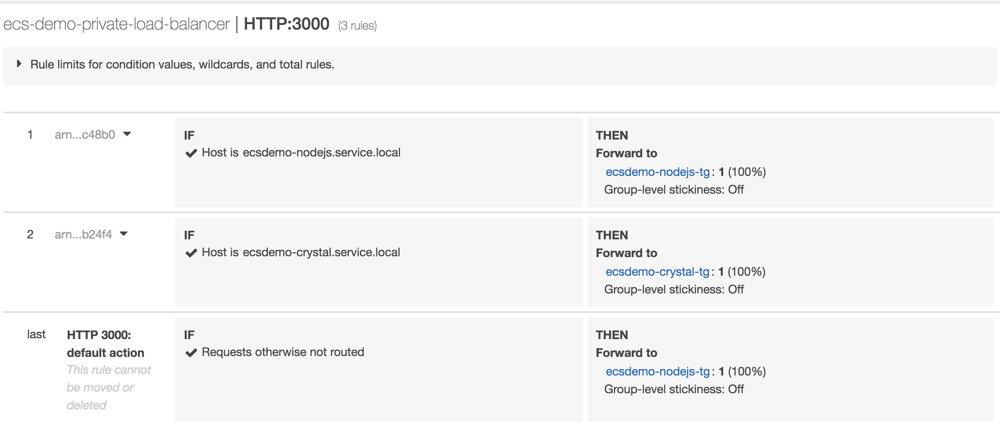
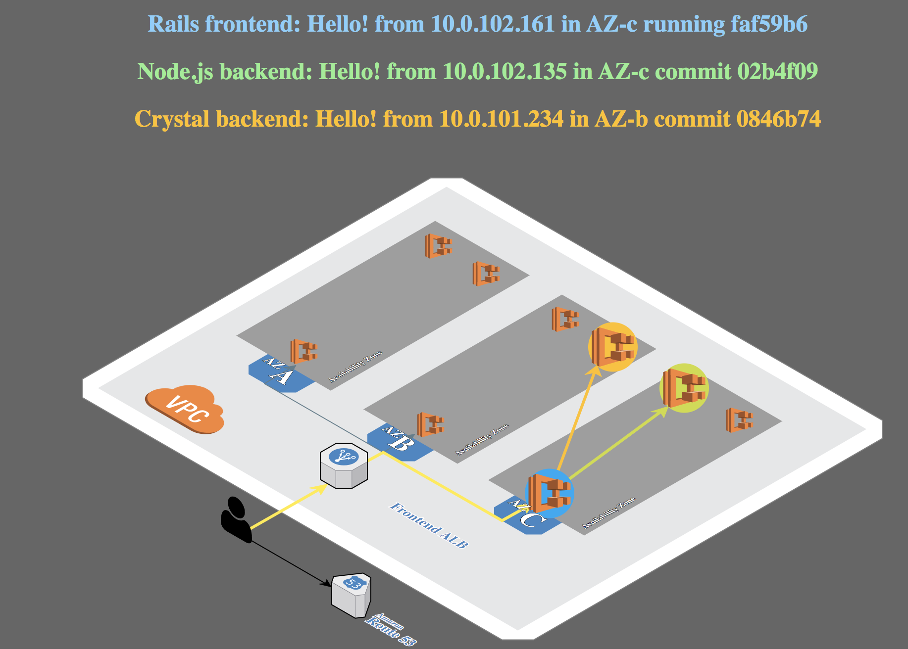

# ECS Fargate Workshop - Module02 - Deploy Micro Services

## Prepare security group and ecs-cli command
```bash
export clustername=$(aws cloudformation describe-stacks --stack-name container-demo --query 'Stacks[0].Outputs[?OutputKey==`ClusterName`].OutputValue' --output text)
export target_group_arn=$(aws cloudformation describe-stack-resources --stack-name container-demo-alb | jq -r '.[][] | select(.ResourceType=="AWS::ElasticLoadBalancingV2::TargetGroup").PhysicalResourceId')
export vpc=$(aws cloudformation describe-stacks --stack-name container-demo --query 'Stacks[0].Outputs[?OutputKey==`VpcId`].OutputValue' --output text)
export ecsTaskExecutionRole=$(aws cloudformation describe-stacks --stack-name container-demo --query 'Stacks[0].Outputs[?OutputKey==`ECSTaskExecutionRole`].OutputValue' --output text)
export subnet_1=$(aws cloudformation describe-stacks --stack-name container-demo --query 'Stacks[0].Outputs[?OutputKey==`PrivateSubnetOne`].OutputValue' --output text)
export subnet_2=$(aws cloudformation describe-stacks --stack-name container-demo --query 'Stacks[0].Outputs[?OutputKey==`PrivateSubnetTwo`].OutputValue' --output text)
export subnet_3=$(aws cloudformation describe-stacks --stack-name container-demo --query 'Stacks[0].Outputs[?OutputKey==`PrivateSubnetThree`].OutputValue' --output text)
export security_group=$(aws cloudformation describe-stacks --stack-name container-demo --query 'Stacks[0].Outputs[?OutputKey==`ContainerSecurityGroup`].OutputValue' --output text)

cd ~/workspace/ecs-workshop-gcr

# Configure ecs-cli to talk to your cluster
ecs-cli configure --region $AWS_REGION --cluster $clustername --default-launch-type FARGATE --config-name container-demo
INFO[0000] Saved ECS CLI cluster configuration container-demo.

# Authorize traffic
aws ec2 authorize-security-group-ingress --group-id "$security_group" \
 --protocol tcp --port 3000 --cidr 0.0.0.0/0 --region $AWS_REGION
```

## Deploy internal ALB for backend ecsdemo-nodejs Service
```bash
# Create internal ALB
aws elbv2 create-load-balancer --name ecs-demo-private-load-balancer \
--subnets $subnet_1 $subnet_2 $subnet_3 --security-groups $security_group \
--scheme internal --region $AWS_REGION

# Record the LoadBalancerArn and DNSName
export Internal_LoadBalancerArn
export Internal_LoadBalancer_Dns
 
# Create Target Group for ecsdemo-nodejs
aws elbv2 create-target-group --name ecsdemo-nodejs-tg \
--protocol HTTP --port 3000 \
--vpc-id $vpc --target-type ip \
--region $AWS_REGION

# Record the TargetGroupArn
export nodejs_TargetGroupArn

# Create a listener for the Internal ALB and forward to ecsdemo-nodejs-tg
aws elbv2 create-listener --load-balancer-arn $Internal_LoadBalancerArn \
--protocol HTTP --port 3000 \
--default-actions Type=forward,TargetGroupArn=$nodejs_TargetGroupArn \
--region $AWS_REGION --health-check-path "/health"

# Create the route rule for lisenter
aws elbv2 create-rule \
    --listener-arn $listener_arn --priority 5 \
    --conditions file://conditions-host.json \
    --actions Type=forward,TargetGroupArn=$nodejs_TargetGroupArn \
    --region $AWS_REGION

# Contents of conditions-host.json

[
  {
      "Field": "host-header",
      "HostHeaderConfig": {
          "Values": ["ecsdemo-nodejs.service.local"]
      }
  }
]

```

## Deploy the backend ecsdemo-nodejs Service
```bash
# Deploy ecsdemo-nodejs
cd ~/workspace/ecs-workshop-gcr/ecsdemo-nodejs
envsubst < ecs-params.yml.template >ecs-params.yml

ecs-cli compose --region $AWS_REGION --project-name ecsdemo-nodejs service up \
    --create-log-groups --private-dns-namespace service \
    --cluster-config container-demo --container-name ecsdemo-nodejs \
    --container-port 3000 \
    --target-group-arn $nodejs_TargetGroupArn \
    --vpc $vpc
    
INFO[0000] Using ECS task definition                     TaskDefinition="ecsdemo-nodejs:1"
....
INFO[0030] ECS Service has reached a stable state        desiredCount=1 runningCount=1 serviceName=ecsdemo-nodejs
INFO[0030] Created an ECS service                        service=ecsdemo-nodejs taskDefinition="ecsdemo-nodejs:1"

# View the running container
ecs-cli compose --project-name ecsdemo-nodejs service ps \
    --cluster-config container-demo --region $AWS_REGION
    
Name                                                 State    Ports                        TaskDefinition    Health
2e1cf43b-8cb9-492a-9de6-eb56cdf38c4d/ecsdemo-nodejs  RUNNING  10.0.101.202:3000->3000/tcp  ecsdemo-nodejs:1  UNKNOWN 

task_id=$(ecs-cli compose --project-name ecsdemo-nodejs service ps --cluster-config container-demo --region $AWS_REGION | awk -F \/ 'FNR == 2 {print $1}')

# View logs
ecs-cli logs --task-id $task_id \
    --follow --cluster-config container-demo --region $AWS_REGION

# Scale the tasks
ecs-cli compose --project-name ecsdemo-nodejs service scale 3 \
    --cluster-config container-demo --region $AWS_REGION
ecs-cli compose --project-name ecsdemo-nodejs service ps \
    --cluster-config container-demo --region $AWS_REGION

# test access
curl --header 'Host: ecsdemo-nodejs.service.local' http://${interl_alb}:3000/
Node.js backend: Hello! from 10.0.101.202 in AZ-b commit 02b4f09
```


## Deploy internal ALB for backend ecsdemo-crystal Service
```bash
# Create Target Group for ecsdemo-crystal
aws elbv2 create-target-group --name ecsdemo-crystal-tg \
--protocol HTTP --port 3000 \
--vpc-id $vpc --target-type ip \
--region $AWS_REGION --health-check-path "/health"

# Record the TargetGroupArn
export crystal_TargetGroupArn


# Create the route rule for lisenter
aws elbv2 create-rule \
    --listener-arn $listener_arn --priority 5 \
    --conditions file://conditions-host.json \
    --actions Type=forward,TargetGroupArn=$crystal_TargetGroupArn \
    --region $AWS_REGION

# Contents of conditions-host.json

[
  {
      "Field": "host-header",
      "HostHeaderConfig": {
          "Values": ["ecsdemo-crystal.service.local"]
      }
  }
]

```



## Deploy the backend ecsdemo-crystal service with internal ALB
```bash
cd ~/workspace/ecs-workshop-gcr/ecsdemo-crystal
envsubst < ecs-params.yml.template >ecs-params.yml

ecs-cli compose --region $AWS_REGION --project-name ecsdemo-crystal service up \
    --create-log-groups \
    --private-dns-namespace service \
    --cluster-config container-demo --container-name ecsdemo-crystal \
    --container-port 3000 \
    --target-group-arn $crystal_TargetGroupArn \
    --vpc $vpc

INFO[0000] Using ECS task definition                     TaskDefinition="ecsdemo-crystal:1"
...
INFO[0030] ECS Service has reached a stable state        desiredCount=1 runningCount=1 serviceName=ecsdemo-crystal
INFO[0030] Created an ECS service                        service=ecsdemo-crystal taskDefinition="ecsdemo-crystal:1"

ecs-cli compose --project-name ecsdemo-crystal service ps \
    --cluster-config container-demo --region $AWS_REGION

task_id=$(ecs-cli compose --project-name ecsdemo-crystal service ps --cluster-config container-demo --region $AWS_REGION | awk -F \/ 'FNR == 2 {print $1}')

# Referencing task id from above ps command
ecs-cli logs --task-id $task_id \
    --follow --cluster-config container-demo

# Scale the tasks
ecs-cli compose --project-name ecsdemo-crystal service scale 3 \
    --cluster-config container-demo
ecs-cli compose --project-name ecsdemo-crystal service ps \
    --cluster-config container-demo

# test access
curl --header 'Host: ecsdemo-crystal.service.local' http://${interl_alb}:3000/crystal
Crystal backend: Hello! from 10.0.102.192 in AZ-c commit 0846b74
```

## Service registrer and discovery
In China region, the ECS service.discovery has not been launched, we have to leverage the route53 alias to do service registrer and discovery

In Global region, you can add the `--enable-service-discovery` in each `ecs-cli compose service up` to enable the native Service Discovery as discribed in [ecs service discovery blog](https://aws.amazon.com/blogs/aws/amazon-ecs-service-discovery/)

### Create service.local private hosted zone on Route53
```bash
# craete a private hosted zone "service.local"
aws route53 create-hosted-zone --name service.local \
--vpc VPCRegion=$AWS_REGION,VPCId=$vpc --caller-reference ="$(date)" --hosted-zone-config PrivateZone=true \
--endpoint-url https://route53.amazonaws.com.cn --region cn-northwest-1

# Optional - associate to more VPCs in the same region
aws route53 associate-vpc-with-hosted-zone --hosted-zone-id $YOUR_ZONE_ID  \
--vpc VPCRegion=$AWS_REGION,VPCId=$vpc_2 \
--endpoint-url https://route53.amazonaws.com.cn --region cn-northwest-1

# Check hosted zone
aws route53 list-hosted-zones --endpoint-url https://route53.amazonaws.com.cn --region cn-northwest-1 \
| jq '.HostedZones[] | select(.Name=="service.local.")'
```

### create 2 aliases for ecsdemo-crystal.service.local and ecsdemo-nodejs.service.local to the dns name of interl_alb.
```bash
aws route53 change-resource-record-sets --hosted-zone-id $YOUR_ZONE_ID  --change-batch file://crystal-alias.json \
--endpoint-url https://route53.amazonaws.com.cn --region cn-northwest-1


crystal-alias.json content
{
     "Comment": "Creating Alias resource record sets in Route 53",
     "Changes": [{
                "Action": "CREATE",
                "ResourceRecordSet": {
                            "Name": "ecsdemo-crystal.service.local",
                            "Type": "A",
                            "AliasTarget":{
                                    "HostedZoneId": "ZM7IZAIOVVDZF",
                                    "DNSName": "<Internal_LoadBalancer_Dns>",
                                    "EvaluateTargetHealth": false
                              }}
                }]
}

aws route53 change-resource-record-sets --hosted-zone-id $YOUR_ZONE_ID --change-batch file://nodejs-alias.json \
--endpoint-url https://route53.amazonaws.com.cn --region cn-northwest-1

nodejs-alias.json content
{
     "Comment": "Creating Alias resource record sets in Route 53",
     "Changes": [{
                "Action": "CREATE",
                "ResourceRecordSet": {
                            "Name": "ecsdemo-nodejs.service.local",
                            "Type": "A",
                            "AliasTarget":{
                                    "HostedZoneId": "ZM7IZAIOVVDZF",
                                    "DNSName": "<Internal_LoadBalancer_Dns>",
                                    "EvaluateTargetHealth": false
                              }}
                }]
}

# Check the resource-record-sets
aws route53 list-resource-record-sets --hosted-zone-id $YOUR_ZONE_ID \
--endpoint-url https://route53.amazonaws.com.cn --region cn-northwest-1

# On the Cloud9 or EC2 in the same VPC of ECS Fargate cluster or hosted-zone assicated VPC
nslookup ecsdemo-crystal.service.local
nslookup ecsdemo-nodejs.service.local

```

## Deploy the Frontend Service ecsdemo-frontend
```bash
cd ~/workspace/ecs-workshop-gcr/ecsdemo-frontend
envsubst < ecs-params.yml.template >ecs-params.yml

ecs-cli compose --region $AWS_REGION --project-name ecsdemo-frontend service up \
    --create-log-groups \
    --target-group-arn $target_group_arn \
    --private-dns-namespace service \
    --container-name ecsdemo-frontend \
    --container-port 3000 \
    --cluster-config container-demo \
    --vpc $vpc
    
INFO[0000] Using ECS task definition                     TaskDefinition="ecsdemo-frontend:4"
....
INFO[0045] ECS Service has reached a stable state        desiredCount=1 runningCount=1 serviceName=ecsdemo-frontend
INFO[0045] Created an ECS service                        service=ecsdemo-frontend taskDefinition="ecsdemo-frontend:4"

# View running container
ecs-cli compose --project-name ecsdemo-frontend service ps \
    --cluster-config container-demo --region $AWS_REGION
Name                                                   State    Ports                        TaskDefinition      
00024401-de3c-4be2-87d3-d9fa4e8f092b/ecsdemo-frontend  RUNNING  10.0.101.196:3000->3000/tcp  ecsdemo-frontend:4

task_id=$(ecs-cli compose --project-name ecsdemo-frontend service ps --cluster-config container-demo --region $AWS_REGION | awk -F \/ 'FNR == 2 {print $1}')

# View logs
ecs-cli logs --task-id $task_id --follow --cluster-config container-demo --region $AWS_REGION

# Check reachability
alb_url=$(aws cloudformation describe-stacks --stack-name container-demo-alb --query 'Stacks[0].Outputs[?OutputKey==`ExternalUrl`].OutputValue' --output text --region $AWS_REGION)
echo "Open $alb_url in your browser"

# Scale the tasks
ecs-cli compose --project-name ecsdemo-frontend service scale 3 \
    --cluster-config container-demo --region $AWS_REGION

ecs-cli compose --project-name ecsdemo-frontend service ps \
    --cluster-config container-demo --region $AWS_REGION
```

End 2 End micro services integration



## Cleanup

```bash
internal ALB tg
Interal ALB

cd ~/workspace/ecs-workshop-gcr/ecsdemo-frontend 
ecs-cli compose --project-name ecsdemo-frontend service rm --region $AWS_REGION
cd ~/workspace/ecs-workshop-gcr/ecsdemo-nodejs
ecs-cli compose --project-name ecsdemo-nodejs service rm --region $AWS_REGION

aws route53 delete-hosted-zone --id YOUR_ZONE_ID 
```