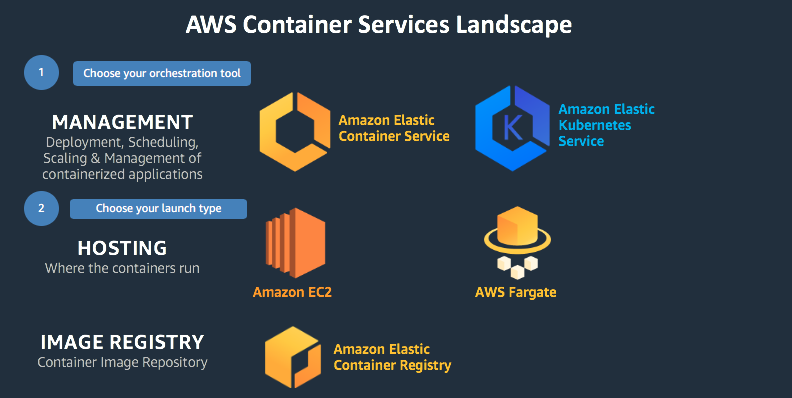

# GCR Amazon ECS Workshop

Amazon Elastic Container Service (Amazon ECS) is a highly scalable, fast, container management service that makes it easy to run, stop, and manage Docker containers on a cluster. There are 2 cluster launch types:

1. Fargate: Host the cluster as serverless approach that is managed by Amazon ECS. You only need focus on launching your services or tasks
2. ECS on EC2. To provide more control, you can host your tasks on a cluster that you manage by using the EC2 launch type.

You can use Amazon ECS to schedule the placement of containers across your cluster based on your resource needs, isolation policies, and availability requirements.

Amazon ECS can be used to run microservices workloads, scale batch jobs， machine learning and Extract-Transform-Load (ETL) workloads, and etc.

Amazon Container Serivces Landscape

## Concept

1. `Amazon ECS cluster`: is a logical grouping of tasks or services.
2. `The task definition`: is a json file that describes one or up to 10 containers to form your application. It can be treat as the blueprint for your application
3. `A task`: is instantiation of a task definition within a cluster. After you have created a task definition for your application within Amazon ECS, you can specify the number of tasks that will run on your cluster. Each task has its own isolation boundary and does not share the underlying kernel, CPU resources, memory resources, or elastic network interface with another task.
4. `The task scheduler`: is responsible for placing tasks within your cluster. There are different [scheduling options](https://docs.aws.amazon.com/AmazonECS/latest/developerguide/scheduling_tasks.html)
5. `A service`: is logical group of a specified number of tasks in an Amazon ECS cluster to serve the business logic of your application. ECS maintaining the desired count of tasks in your service.

   You can run your service behind a load balancer to distributes traffic cross the instance by define `Service scheduler`:

   - REPLICA: places and maintains the desired number of tasks across your cluster.
   - DAEMON: deploys exactly one task on each active container instance that meets all of the task placement constraints that you specify in your cluster.

## Testing utility and test case

- [ECS CLI Demo](ecs-cli-demo/ecs-cli-demo.md)
- [ECS Windows Containers Demo](ECS-Windows-Container.md)
- [ECS Fargate QuickStart](ECS-Fargate-QuickStart.md)
- [ECS and Fargate Workshop](ECS-Workshop.md)
- [Cross Region ECR Replication](Cross-Region-ECR-Creation.md)
- [Fargate CDK Demo](ECS-Workshop-cdk.md)
- [ECS with load balance and API Gateway for microservices](ECS-ELB-APIGW.md)
- [How can I create an Application Load Balancer and then register Amazon ECS tasks automatically](ECS-ALB-Dynamic-Port.md)
- [Stateful workloads on ECS Fargate - persistent storage on EFS](Persitent-Storeage-On-EFS.md)
- [Fargate PHP example](Fargate-PHP-example.md)
## Resource

[ECS Offical Guide](https://docs.aws.amazon.com/AmazonECS/latest/developerguide/Welcome.html)
