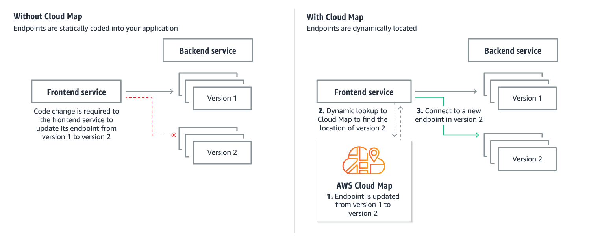

# ECS service discovery
Containers are immutable by nature, they can drain regularly and be replaced with newer versions of the service. There is a need to register the new and deregister the old/unhealthy services which means you need container service discovery.

- [CloudMap based which can be used in global region](https://docs.aws.amazon.com/AmazonECS/latest/developerguide/service-discovery.html)

Your Amazon ECS service can optionally be configured to use Amazon ECS Service Discovery. Service discovery uses AWS Cloud Map API actions to manage HTTP and DNS namespaces for your Amazon ECS services.

AWS Cloud Map is a cloud resource discovery service. With Cloud Map, you can define custom names for your application resources, and it maintains the updated location of these dynamically changing resources.

- [R53 based ECS service discovery](https://aws.amazon.com/blogs/aws/amazon-ecs-service-discovery/)

